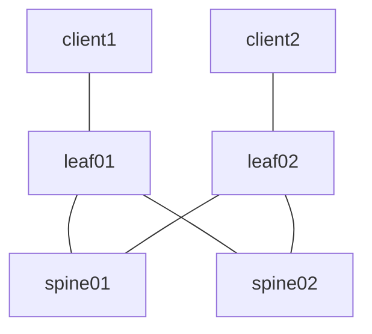

# simple-evpn-vxlan-l2
Simple EVPN-VXLAN 3-stage IP CLOS fabric using [FRR](https://docs.frrouting.org/en/latest/evpn.html) to facilitate Layer 2 connectivity over VNI 110 between ```client1``` connected to ```leaf01``` on VLAN10 and ```client2``` connected to ```leaf02``` on VLAN10

## Topology


## Resources

### IP Assignments
**NOTE**: The Overlay/VTEP assignments for spine01/spine02 are not actually implemented, or even required, since our VTEP's in this lab are on leaf01/leaf02. The assignments are therefore just for consistency purposes

| Scope              | Network       | Sub-Network   | Assignment    | Name            |
| ------------------ | ------------- | ------------- | ------------- | -------         |
| Management         | 172.28.1.0/24 |               | 172.28.1.2/24 | spine01         |
| Management         | 172.28.1.0/24 |               | 172.28.1.3/24 | spine02         |
| Management         | 172.28.1.0/24 |               | 172.28.1.4/24 | leaf01          |
| Management         | 172.28.1.0/24 |               | 172.28.1.5/24 | leaf02          |
| Router ID (lo)     | 172.29.1.0/24 |               | 172.19.1.1/24 | spine01         |
| Router ID (lo)     | 172.29.1.0/24 |               | 172.19.1.2/24 | spine02         |
| Router ID (lo)     | 172.29.1.0/24 |               | 172.19.1.3/24 | leaf01          |
| Router ID (lo)     | 172.29.1.0/24 |               | 172.19.1.4/24 | leaf02          |
| Overlay/VTEP (lo1) | 172.30.1.0/24 |               | 172.30.1.1/24 | spine01         |
| Overlay/VTEP (lo1) | 172.30.1.0/24 |               | 172.30.1.2/24 | spine02         |
| Overlay/VTEP (lo1) | 172.30.1.0/24 |               | 172.30.1.3/24 | leaf01          |
| Overlay/VTEP (lo1) | 172.30.1.0/24 |               | 172.30.1.4/24 | leaf02          |
| P2P Links          | 172.31.1.0/24 | 172.31.1.0/31 | 172.31.1.0/31 | spine01::leaf01 |
| P2P Links          | 172.31.1.0/24 | 172.31.1.0/31 | 172.31.1.1/31 | leaf01::spine01 |
| P2P Links          | 172.31.1.0/24 | 172.31.1.2/31 | 172.31.1.2/31 | spine01::leaf02 |
| P2P Links          | 172.31.1.0/24 | 172.31.1.2/31 | 172.31.1.3/31 | leaf02::spine01 |
| P2P Links          | 172.31.1.0/24 | 172.31.1.4/31 | 172.31.1.4/31 | spine02::leaf01 |
| P2P Links          | 172.31.1.0/24 | 172.31.1.4/31 | 172.31.1.5/31 | leaf01::spine02 |
| P2P Links          | 172.31.1.0/24 | 172.31.1.6/31 | 172.31.1.6/31 | spine02::leaf02 |
| P2P Links          | 172.31.1.0/24 | 172.31.1.6/31 | 172.31.1.7/31 | leaf02::spine02 |

### ASN Assignments
| ASN   | Device  |
| ----- | ------- |
| 65500 | spine01 |
| 65501 | spine02 |
| 65502 | leaf01  |
| 65503 | leaf02  |

### VXLAN Segments
| vni | name | network      | leaf   | host    | host ip   | vlan |
| --- | ---- | ------------ | ------ | ------- | --------- | ---- |
| 110 | RED  | 10.10.1.0/24 | leaf01 | client1 | 10.10.1.1 | 10   |
| 110 | RED  | 10.10.1.0/24 | leaf02 | client2 | 10.10.1.2 | 10   |

## Deployment
**NOTE**: Assumes Visual Studio Code has properly deployed the development container per the top-level [README.md](../../README.md)

Access the development container
```
docker exec -it clab-dev bash
```

Change into the lab directory
```
cd workspaces/clab-workbench/labs/simple-evpn-vxlan-l2/
```

Execute the [deployment script](#deployment-script) to start the lab
```
bash deploy.sh
```

Stop the lab, tear down the CONTAINERlab containers
```
bash destroy.sh
```

## Deployment Script
The ```deploy.sh``` script performs the following functions

* Creates the [CONTAINERlab network](https://containerlab.dev/manual/topo-def-file/) based on the [setup.yml](setup.yml) topology definition
* Executes the [setup.sh](setup.sh) configuration script
  * Loops through each client to execute the respective script within the [clients](clients) folder
    * The script configures the Ethernet VLAN interface connected to the leaf
  * Loops through each switch to execute the respective script within the ```spine01|02 leaf01|02``` folder
    * The script configures the Linux-level Ethernet, Dummy, VXLAN, and Bridge interfaces; leaving the IP/Network-level configuration to FRR

## Validation
To validate that everything is working as expected, execute a PING from ```client1``` to ```client2```

Access the ```client1``` container _(assumes you are still in the development container per the [deployment](#deployment) instructions)_
```
docker exec -it clab-simple-evpn-vxlan-l2-client1 bash
```

PING the ```client2``` host IP
```
ping -c 5 10.10.1.2
```
